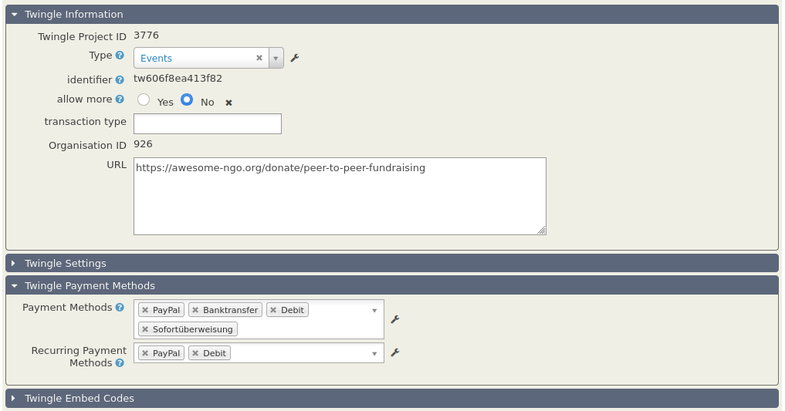
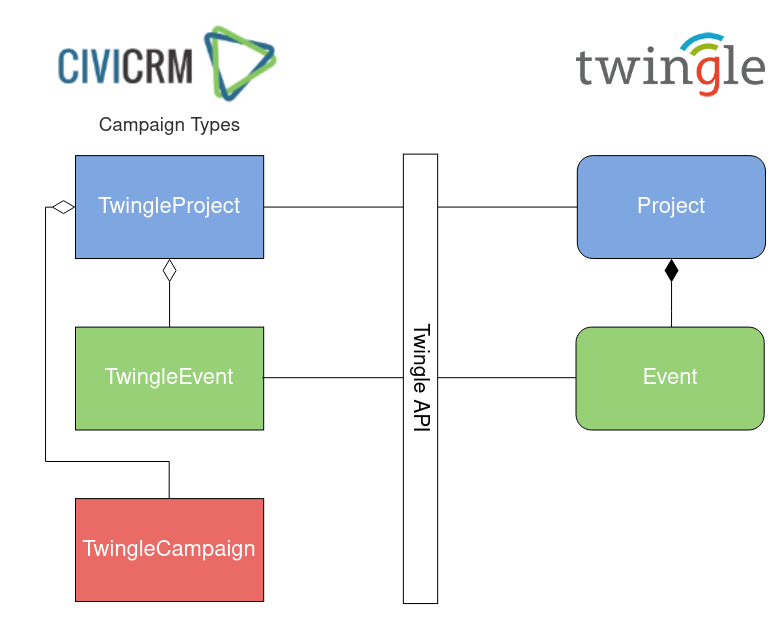
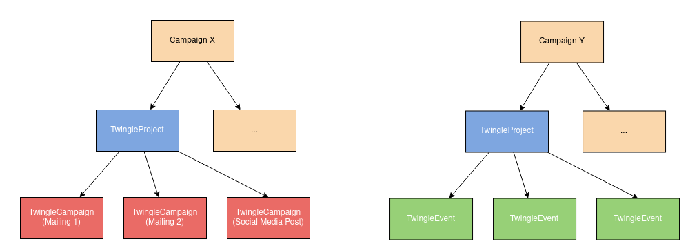
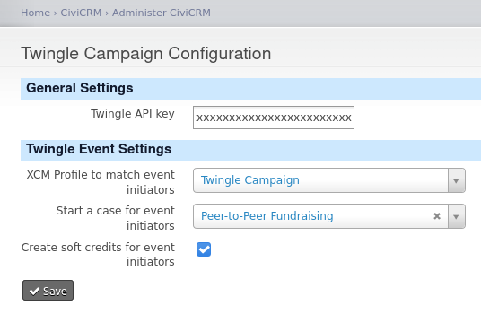
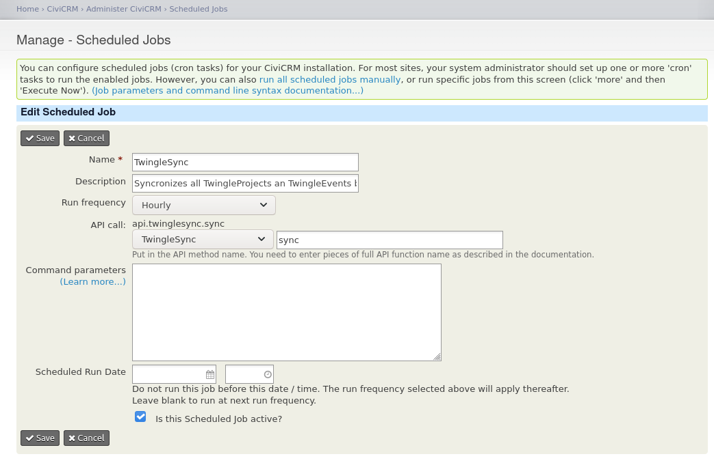

# Twingle Campaign

This extension allows you:

- to manage [Twingle](https://www.twingle.de/) projects and events as campaigns in CiviCRM (including almost all
  donation form settings)
- to automatically assign donations that arrive via Twingle donation forms to the corresponding campaign
- to track the origin of your donations

The extension is licensed under [AGPL-3.0](LICENSE.txt).

## Requirements

* PHP v7.2+
* CiviCRM 5.14+
* Extension: [Twingle API](https://github.com/systopia/de.systopia.twingle)
* Extension: [Campaign Manager](https://github.com/systopia/de.systopia.campaign)
* Extension: [Extended Contact Matcher (XCM)](https://github.com/systopia/de.systopia.xcm)

The **[Twingle API](https://github.com/systopia/de.systopia.twingle)** allows you to receive API calls from Twingle to
create donations. The **Twingle Campaign** extension enhances this functionality by automatically creating campaigns for
each donation form (project) and peer-to-peer event and assigning the incoming donations to them. While you can use
the **Twingle API** extension on its own, there is no point in using the **Twingle Campaign** extension without the
other.

The **[Campaign Manager](https://github.com/systopia/de.systopia.campaign)** is required to visualize the projects and
events within the campaign tree as parent and child campaigns.

The **[XCM](https://github.com/systopia/de.systopia.xcm)** is needed to match or create contacts for people which start
a peer-to-peer event.

## Concept

The idea of the **Twingle Campaign** extension is to represent Twingle donation forms (projects) and peer-to-peer events
as campaigns in CiviCRM. Therefore, the extension creates new campaign types:

- [Twingle Project](docs/Twingle_Project.md)
- [Twingle Event](docs/Twingle_Event.md)

There is another campaign type: [Twingle Campaign](docs/Twingle_Campaign.md)
Please don't get confused: this campaign type is named after this extension because it's a really clever thing that
allows you to track the origin a donation.

Together with normal campaigns, the three Twingle campaign types can be used to build complex campaign trees. This
allows you to keep track of the performance of every single donation form, peer-to-peer event and newsletter (with
TwingleCampaign cid link) while it sums up all donations in the parent campaigns.

To assign the incoming donations to the corresponding campaigns, the *Twingle Campaign* extension uses
an [API Wrapper](docs/API_Wrapper.md) that extends the function of the **Twingle API** (extension).

## Configuration

Bevore you can synchronize your Twingle projects and events, you have to enter your Twingle API key on the Twingle
Campaign Configuration page.

If you would like to match or create contacts for event initiators (people who start their own peer-to-peer event) via
the XCM, make sure to create a [new XCM configuration](docs/Example Settings/XCM_profile.md) for this purpose.

On default, this extension will synchronize all Twingle projects and events once every hour. You can increase or
decrease this interval by changing the configuration of the scheduled job named *TwingleSync*.

Furthermore, the synchronization may get triggered also if a donation for an unknown event arrives via the Twingle API
extension.

## Known Issues

- The **Campaign Manager** displays a *«Campaign XY has been saved»* message even if the input validation failed and the
  campaign was **not saved or sent** to Twingle.

## To Do's

- [ ] Make the Twingle Event Settings for contact matching, case creation and creation of soft credits an individual
  setting in each project
- [ ] Make more payment methods available