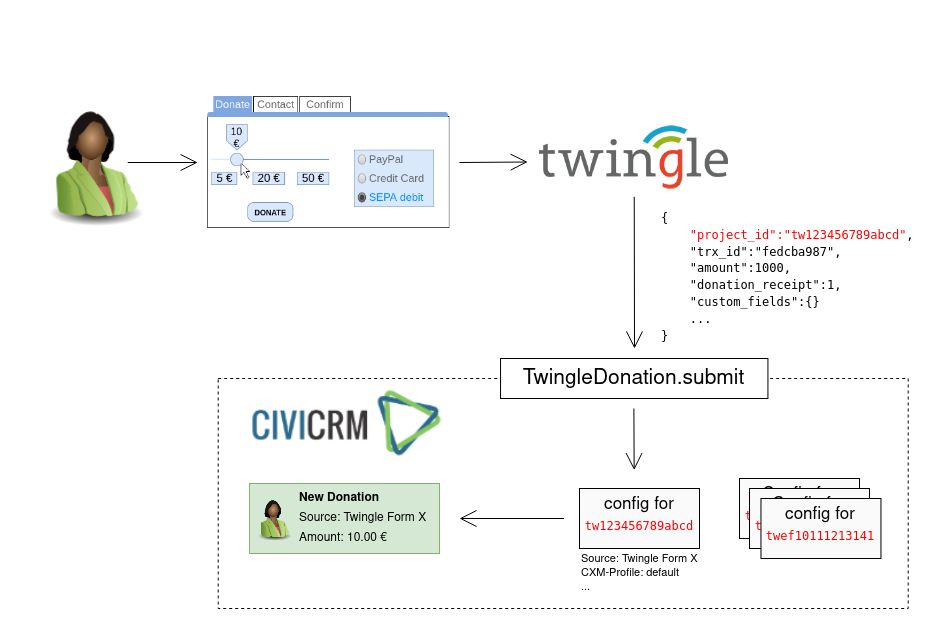
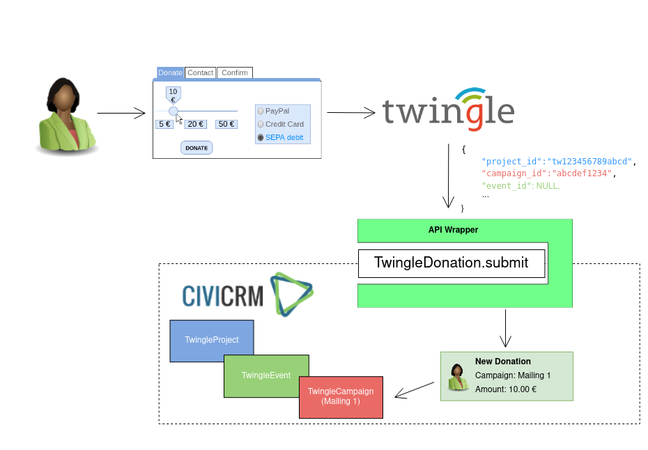

# API Wrapper

The **Twingle API** extension uses profiles to process every incoming donation. When Twingle calls the
*TwingleDonation.submit* API, provided by the **Twingle API** extension, the API assigns the donation to the
corresponding profile by looking up the project id which comes with the call. The profile settings then specifies how
the donation should be treated.

The **Twingle Campaign** extension puts an API wrapper around the *TwingleDonation.submit* API. This first it searches
the call for either a project id, an event id or a campaign id and depending on the result, it searches CiviCRM for the

Furthermore, the API wrapper enables you to create soft credits for peer-to-peer event initiators.