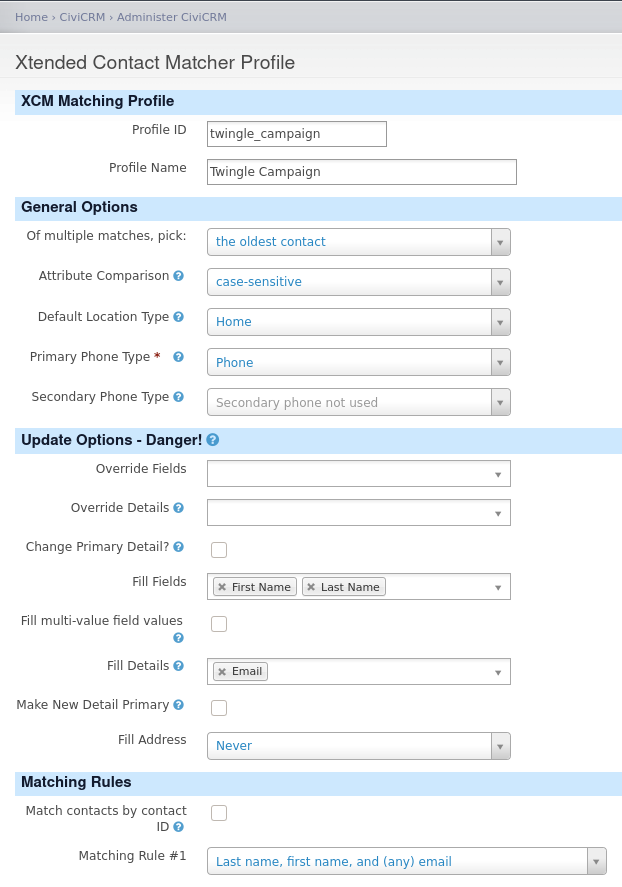

# XCM example settings
The contact information that Twingle provides about the peer-to-peer event initiators are:
- First Name
- Last Name
- Email

So make sure you set only these fields as rules for matching.

