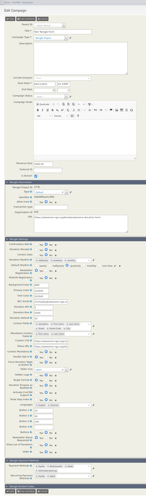

# Twingle Project

This campaign type represents Twingle donation forms. *Twingle Projects* are campaigns which get synchronized between
Twingle and your CiviCRM instance in both directions. A *Twingle Project* has three extra sections:

## Twingle Information

This section shows the external Twingle id, the identifier and the project type (default, event or membership). You can
change the project type at any time, but please be aware that your Twingle donation forms will change their appearance
depending on what project type is selevted.

## Twingle Settings

Here you can find almost all settings to configure a donation form. Each setting has a help text.

Currently, there is no front end input validation but all settings get validated on server side when the form gets
saved. If the validation fails, an error message will be displayed that contains further information. In this case, the
form won't get saved.

## Twingle Payment Methods

These settings allow you to specify the payment methods that you want to offer to users for one time and recurring
donations.

Currently, the extension only supports to configure *PayPal*, *bank transfer*, *debit* and *Sofortüberweisung* as one
time payment methods and *PayPal* and *debit* as recurring payment methods. This may be enhanced in future versions.
Nevertheless, you can configure additional payment methods in the *[TwingleMANAGER](https://twinglemanager.de)* – they
won't get overwritten by the *Twingle Campaign* extension.

Please make sure to establish all payment methods in your general *[TwingleMANAGER](https://twinglemanager.de)* settings
before you try to configure them for *Twingle Projects*.

## Twingle Project Preview
